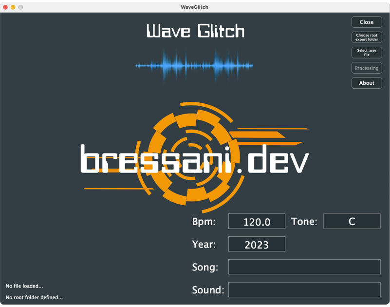

# WaveGlitch par bressani.dev

Bienvenue dans WaveGlitch, une application multiplateforme développée en C++ avec l'ui en JUCE.



## À propos
WaveGlitch est un outil pratique destiné aux producteurs de musique. Il permet de faire des conversions et de les rangers dans un répertoire pret à l'usage dans votre éditeur préféré (Ableton Live, Cubase, etc...)

## Caractéristiques
- **Compatible multiplateforme** : Fonctionne sur tous les systèmes d'exploitation courants. Testé sur Mac OS 13 Ventura (intel), Windows 11 et Ubuntu 22.04 Gnome.
- **Conversion des fichiers audio** : Transformez vos fichiers audio en multi-échantillons 1/2 1/4 1/8 1/16 1/32 1/64 1/128 pour faire des glitchs.
- **Lecture des échantillons**: Écoutez les échantillons depuis la même fenêtre une fois la conversion effectuée.
## Fonctionnement
à faire...

## Licence
WaveGlitch est publié sous la licence open source GNU General Public License v3.0. Vous êtes libre de modifier, distribuer et utiliser le logiciel en accord avec les termes de cette licence.

Pour plus de détails, veuillez consulter le fichier `LICENSE` inclus dans le dépôt.

L'image de fond a été utilisé de GarryKillian on Freepik. Une partie du design du logo a été crée à partir d'une modification de l'image de onfocus sur Freepik.

## Compilation

### MacOs / Windows / Linux
Nécessite cmake pour compiler.

```
cd build
cmake ..
```

## Contact
Pour toute question ou suggestion, n'hésitez pas à me contacter sur [bressani.dev](http://bressani.dev).
